<div align="center">


<h1>AVD Landing Zone</h1>

<p><strong>The Institutional-Grade Platform for Standardized Workspace foundations, CAF Governance, and Multi-Cloud EUC Ecosystems.</strong></p>

[]()
[]()
[]()

<br/>

> **"Industrializing workspace foundations to automate digital workplace delivery."** 
> **AVD Landing Zone** is an enterprise-grade platform designed to provide a secure, measurable, and highly automated foundation for global virtual desktop operations. It orchestrates the complex lifecycle of workspace environments—from automated host pool provisioning and multi-region network reconciliation to high-throughput governance intelligence and unified EUC auditing.

</div>

---

## 🏛️ Executive Summary

Fragmented infrastructure foundations and manual workspace orchestration are strategic operational liabilities; lack of a standardized landing zone framework is a primary barrier to organizational engineering maturity. Organizations fail to scale their virtual desktops not because of a lack of compute, but because of fragmented evaluation standards, lack of automated network reconciliation, and an inability to orchestrate foundation planes with operational precision.

This platform provides the **Foundation Intelligence Plane**. It implements a complete **AVD-Landing-Zone-as-Code Framework**, enabling CTOs and EUC Architects to manage global workspace foundations as first-class citizens. By automating the identification of architectural regressions through real-time telemetry analysis and orchestrating the provisioning of secure performance-driven landing zone policies, we ensure that every organizational workspace—from core corporate hubs to edge regulated spokes—is provisioned by default, audited for history, and strictly aligned with institutional EUC frameworks.

---

## 📐 Architecture Storytelling: Principal Reference Models

### 1. Principal Architecture: Global Workspace Foundation & Intelligence Plane
This diagram illustrates the high-level relationship between the Global User, the AVD Gateway, and the underlying Landing Zone Foundation (Networking, Identity, Storage). It defines the bridge between virtual sessions and the organizational foundation substrate.

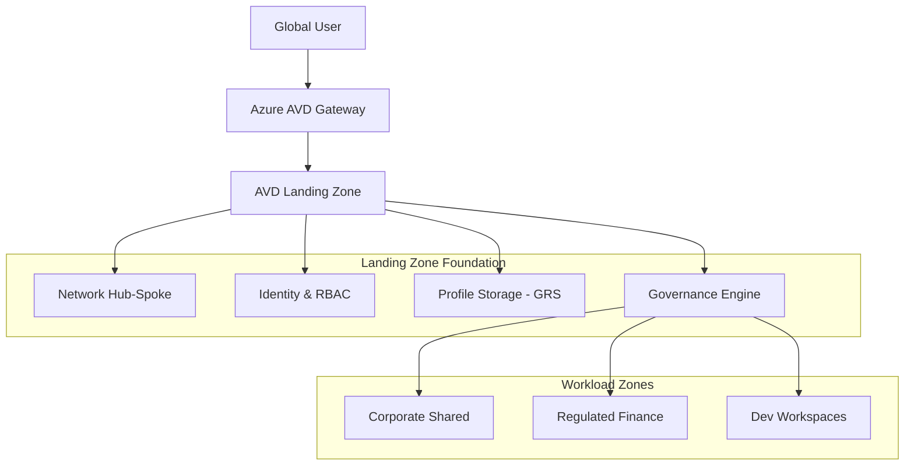

### 2. The Foundation Lifecycle Flow (Deployment & Provisioning)
The continuous path of a workspace foundation from initial region definition and compliance validation to host pool lifecycle management and profile storage synchronization. This ensures zero-interruption operations through dependency-aware deployment flows.

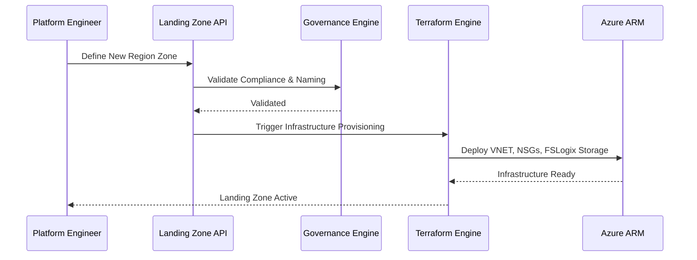

**Host Pool Lifecycle:**
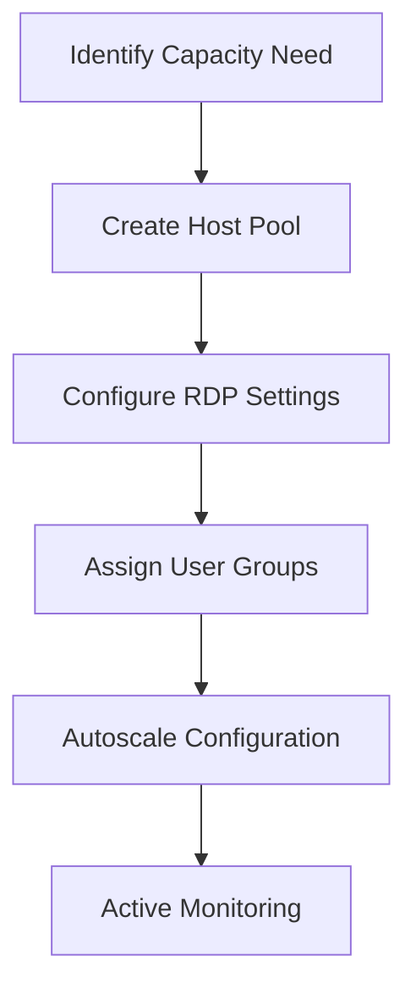

**Profile Storage Flow:**
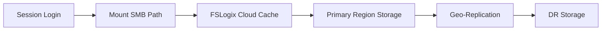

### 3. Distributed Foundation Topology (Network Hub-Spoke)
Strategically orchestrating standardized networking across global regions and diverse resource architecture spokes, providing a unified institutional view of foundation connectivity.

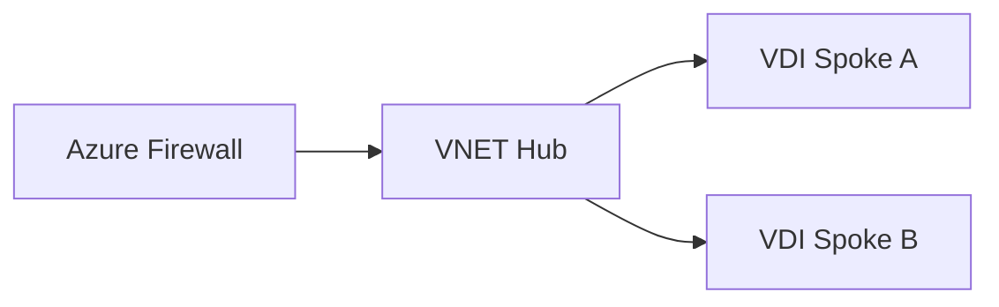

**AVD Enterprise Topology:**
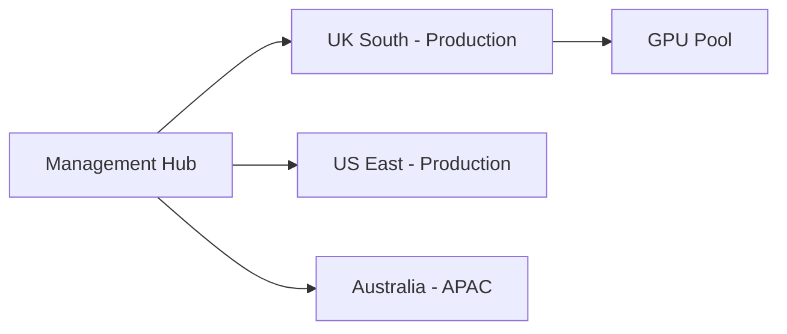

### 4. Governance Hub & Control Plane Flow
Executing complex logic for securing the bridge between deployment requests and Azure resources, ensuring every resource is compliant with policy, costs are optimized, and executive oversight is maintained.

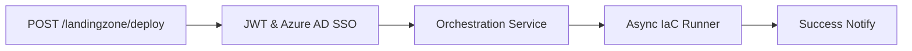

**Governance Compliance Flow:**
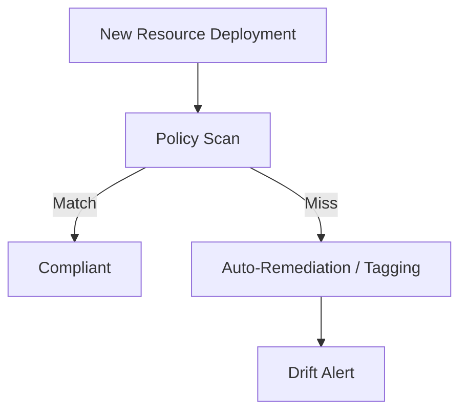

**Cost Optimization Lifecycle:**
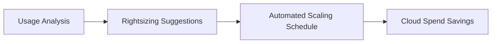

**Executive Governance Workflow:**
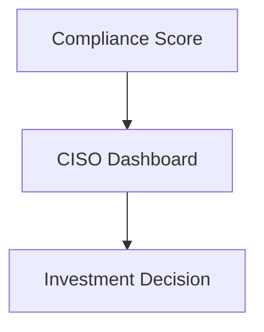

### 5. Multi-Cloud Foundation Federation & Global Topology
Automatically managing unified landing zone standards across diverse cloud tenants and global regions, ensuring institutional data residency and privacy boundaries by default.

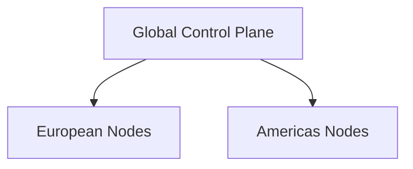

**Region Expansion Workflow:**
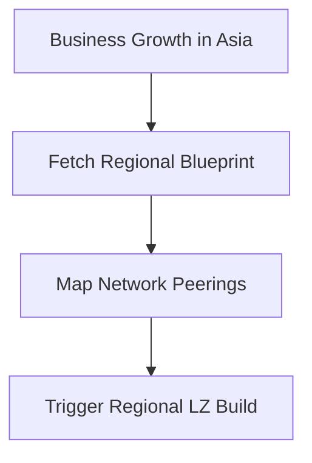

### 6. Encryption & Perimeter Protection Flow (Security Trust Boundary)
Managing the lifecycle of a foundation request, automatically enforcing institutional Conditional Access and MFA standards as required by security policy, ensuring zero-latency security confidence.

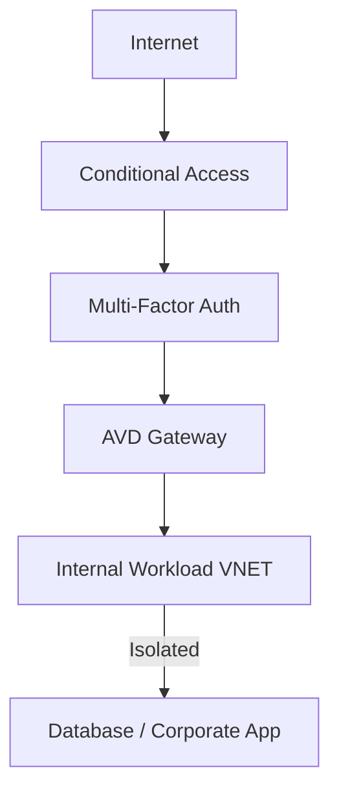

**Contractor Isolated Zone Flow:**
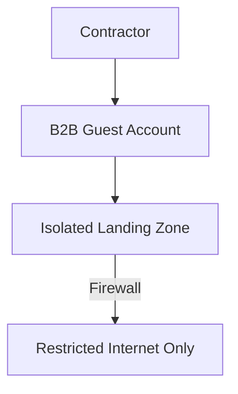

### 7. Institutional Foundation Maturity Scorecard (Insights Dashboard)
Grading organizational performance based on key indicators: Compliance Scores, Resource Utilization, and Foundation Adoption Scores.

### 8. Identity & RBAC for Foundation Governance
Managing fine-grained access to foundation hubs, provisioning workers, and audit logs between Global Management Groups and Business Unit tenants.

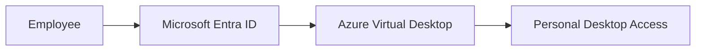

**Multi-Tenant Tenancy Model:**
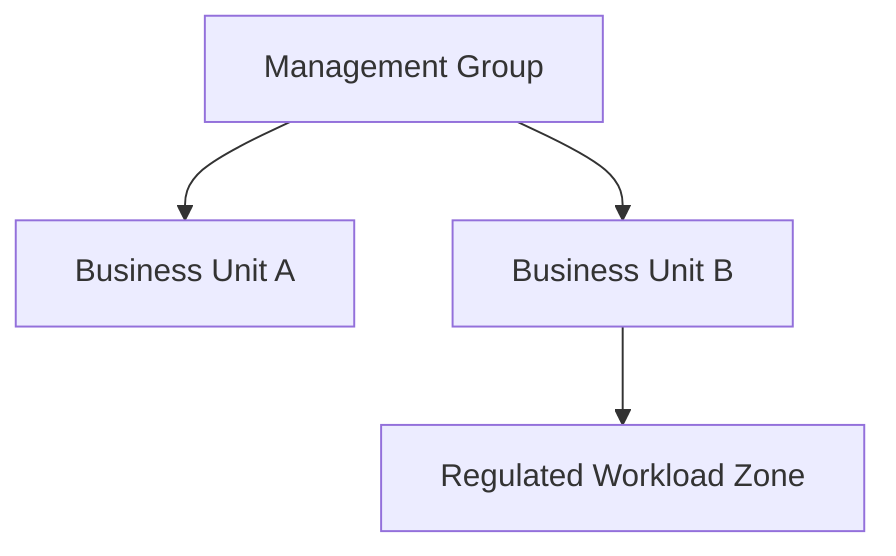

### 9. IaC Deployment: AVD-Landing-Zone-as-Code Framework
Using modular CI/CD pipelines to deploy and manage the versioned distribution of the landing zone templates, Terraform updates, and validation fleets.

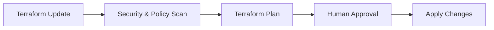

### 10. AIOps Foundation Drift & Risk Validation Flow
Using advanced analytics to identify sudden surges in policy violations, unauthorized foundation changes, or unusual delivery pattern changes that could result in institutional risk or downtime.

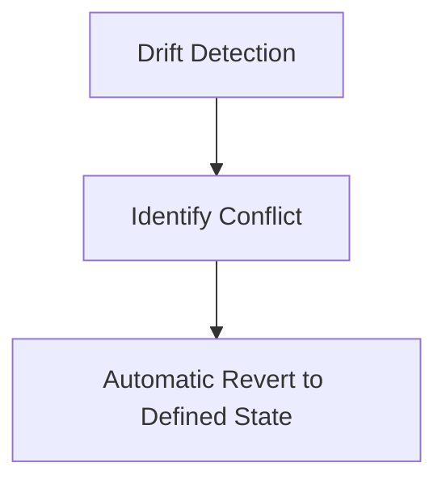

**Disaster Recovery Topology:**
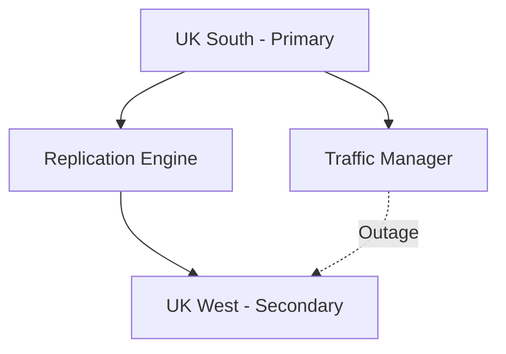

### 11. Metadata Lake for Forensic Foundation Audit
Storing long-term records of every foundation integration event (metadata), every policy remediated, and every monitoring telemetry for institutional record-keeping and forensic analysis.

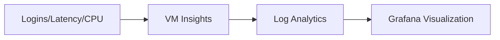

---

## 🏛️ Core Governance Pillars

1.  **Unified Foundation Coordination**: Maximizing resilience by centralizing all foundation measurement through a single institutional plane.
2.  **Automated Workspace Provisioning**: Eliminating "manual tracking" scenarios through proactive orchestration and pattern verification.
3.  **Sequential Foundation Intelligence**: Ensuring zero-interruption operations through dependency-aware foundation-driven data engineering.
4.  **Zero-Trust Identity Protection**: Automatically enforcing identity-based access, MFA encryption, and policy evaluation across all assurance tiers.
5.  **Autonomous Operations Logic**: Guaranteeing reliability through automated industry-specific effectiveness monitoring runbooks.
6.  **Full Foundation Auditability**: Immutable recording of every foundation change and landing zone provision for institutional forensics.

---

## 🛠️ Technical Stack & Implementation

### Foundation Engine & APIs
*   **Framework**: Python 3.11+ / FastAPI.
*   **Performance Engine**: Custom Python-based logic for multi-cloud foundation reconciliation and DORA-style EUC metrics.
*   **Integrations**: Native connectors for Azure ARM, Terraform, and Azure Policy.
*   **Persistence**: PostgreSQL (Foundation Ledger) and Redis (Live Provisioning State).
*   **Auth Orchestrator**: Federated OIDC/SAML for least-privilege foundation management access.

### Governance Dashboard (UI)
*   **Framework**: React 18 / Vite.
*   **Theme**: Dark, Slate, Indigo (Modern high-fidelity productivity aesthetic).
*   **Visualization**: D3.js for delivery topologies and Recharts for ROI velocity analytics.

### Infrastructure & DevOps
*   **Runtime**: AWS EKS or Azure Kubernetes Service (AKS) for management plane.
*   **Measurement Hub**: Managed event sourcing for immutable productivity timeline reconstruction.
*   **IaC**: Modular Terraform for deploying the foundation landing zone and validation fleet.

---

## 🏗️ IaC Mapping (Module Structure)

| Module | Purpose | Real Services |
| :--- | :--- | :--- |
| **`infrastructure/foundation_hub`** | Central management plane | EKS, PostgreSQL, Redis |
| **`infrastructure/enforcers`** | Distributed foundation provisioners | Azure, AWS, GCP APIs |
| **`infrastructure/foundation_pipes`** | Data Ingestion Hubs | Webhooks, Lambda |
| **`infrastructure/auditing`** | Forensic modernization sinks | S3, Athena, Quicksight |

---

## 🚀 Deployment Guide

### Local Principal Environment
```bash
# Clone the AVD Landing Zone repository
git clone https://github.com/devopstrio/avd-landingzone.git
cd avd-landingzone

# Configure environment
cp .env.example .env

# Launch the Foundation stack
make init

# Trigger a mock foundation update and automated guardrail validation simulation
make simulate-landingzone
```

Access the Management Portal at `http://localhost:3000`.

---

## 📜 License
Distributed under the MIT License. See `LICENSE` for more information.

---
<div align="center">
  <p>© 2026 Devopstrio. All rights reserved.</p>
</div>
