<div align="center">


<h1>Azure Virtual Desktop (AVD) Landing Zone</h1>

<p><strong>Standardized Multi-Region Foundation for Enterprise Digital Workspaces</strong></p>

[](https://devopstrio.co.uk/)
[](https://devopstrio.co.uk/)
[](https://devopstrio.co.uk/)
[](/apps/governance-engine)

</div>

---

## 🏛️ Executive Summary

The **AVD Landing Zone** is a flagship enterprise platform that provides the secure, scalable, and governed foundation required to deploy Azure Virtual Desktop (AVD) workloads at global scale. Following the Microsoft Cloud Adoption Framework (CAF) guidelines, this landing zone automates the delivery of networking, identity, storage, and security controls, ensuring that every workspace environment is architecturally sound from day one.

In an era where remote work is central to business continuity, having a standardized "LZ" is critical for rapid expansion, mergers and acquisitions (M&A), and maintaining a consistent security posture across thousands of virtual desktops. This platform decouples the underlying infrastructure from the workspace delivery, providing a resilient "fabric" that supports developers, finance professionals, call centers, and regulated workloads with zero-trust principles.

### Strategic Business Outcomes
- **Rapid Time-to-Value**: Deploy a fully governed, multi-region AVD foundation in minutes rather than weeks through automated IaC.
- **Enterprise-Grade Governance**: Enforce consistent naming, tagging, and security policies automatically, reducing technical debt and compliance risk.
- **Cost-Optimized Foundations**: Right-size networking and storage components from the start, preventing the common "cloud creep" in VDI environments.
- **Accelerated Onboarding**: Provide a plug-and-play architecture for new departments or acquired entities, ensuring immediate productivity within corporate guardrails.

---

## 🏗️ Technical Architecture Details

### 1. High-Level AVD Landing Zone Architecture
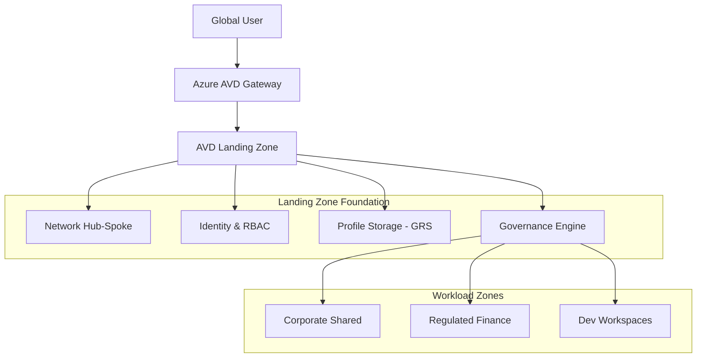

### 2. Landing Zone Deployment Workflow
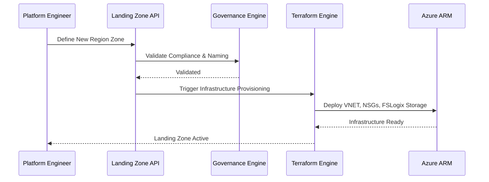

### 3. Host Pool Lifecycle
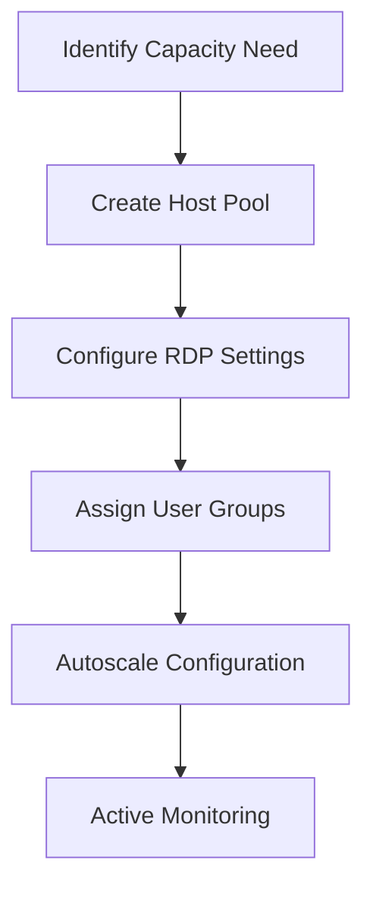

### 4. Profile Storage Flow (FSLogix)
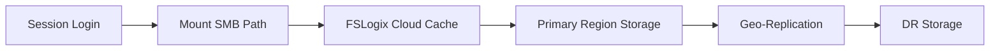

### 5. Governance Compliance Flow
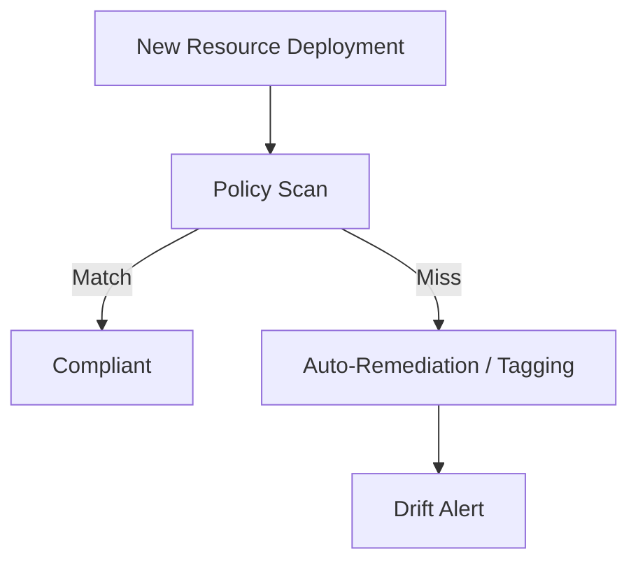

### 6. Security Trust Boundary
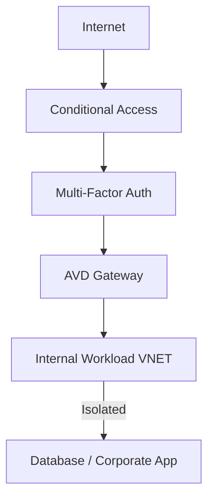

### 7. AVD Enterprise Topology
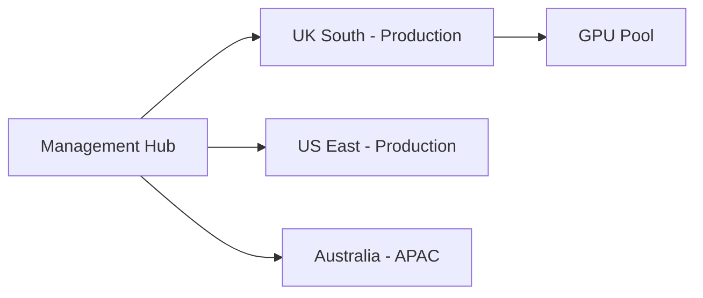

### 8. API Request Lifecycle
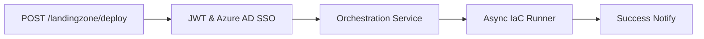

### 9. Multi-Tenant Tenancy Model
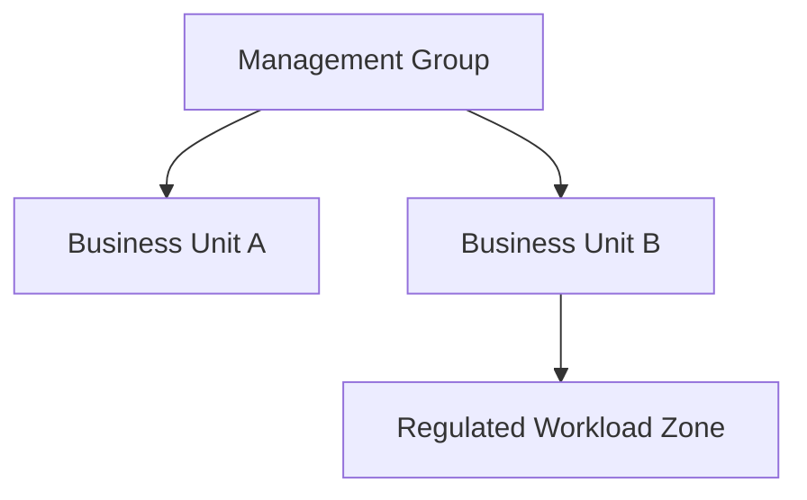

### 10. Monitoring & Telemetry Flow
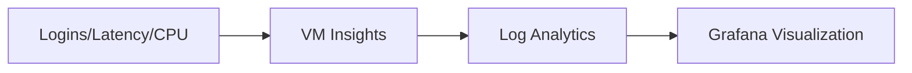

### 11. Disaster Recovery Topology
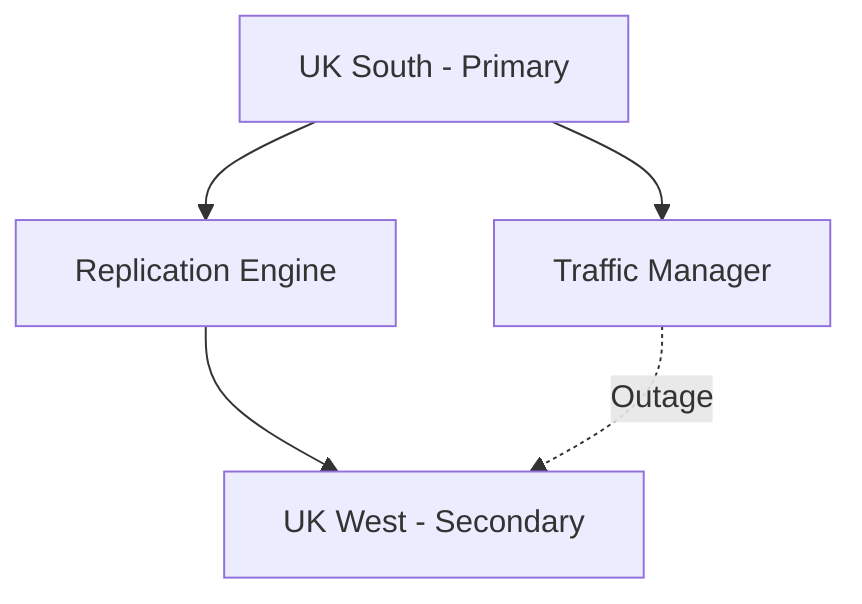

### 12. Region Expansion Workflow
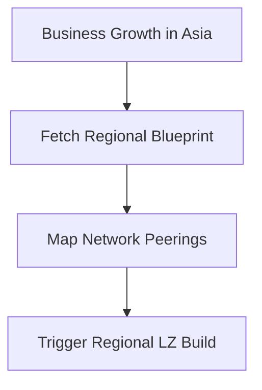

### 13. Identity Federation Model
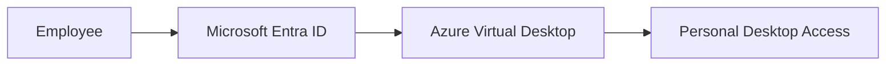

### 14. Cost Optimization Lifecycle
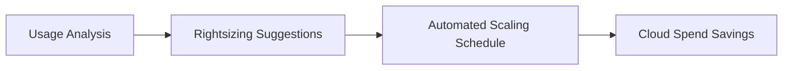

### 15. CI/CD Infrastructure Pipeline
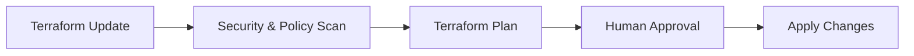

### 16. Executive Governance Workflow
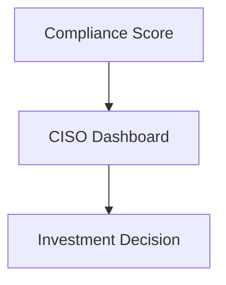

### 17. Contractor Isolated Zone Flow
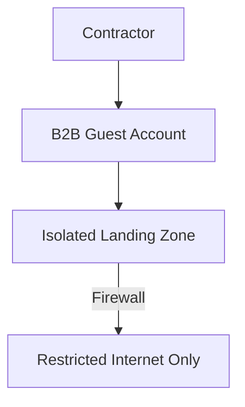

### 18. Network Hub-Spoke Topology
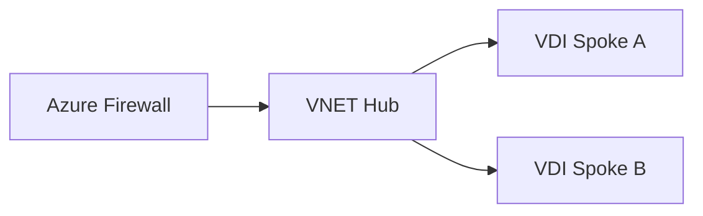

### 19. Global Region Topology
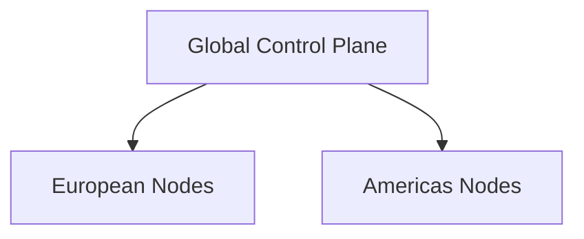

### 20. Policy Drift Remediation
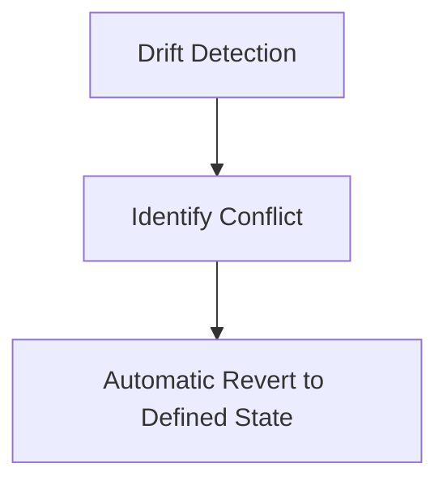

---

## 🚀 Deployment Guide

### Terraform Initialization
```bash
cd terraform/environments/prd
terraform init
terraform apply -auto-approve
```

---
<sub>&copy; 2026 Devopstrio &mdash; Engineering the Secure Foundation for the Global Digital Workplace.</sub>
